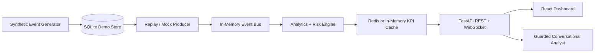
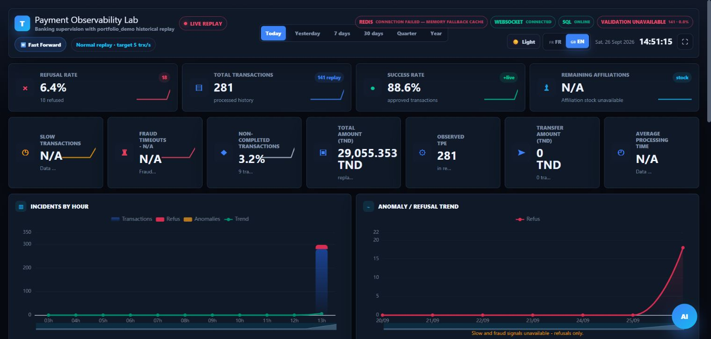
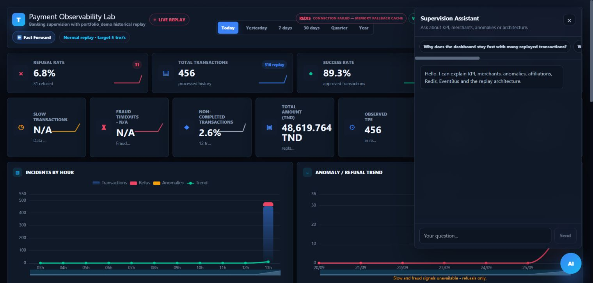
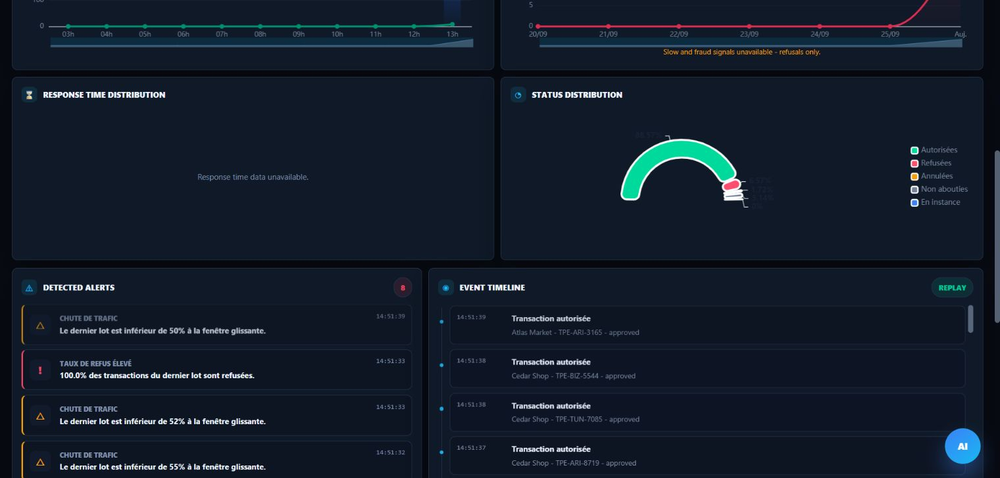
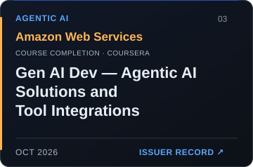
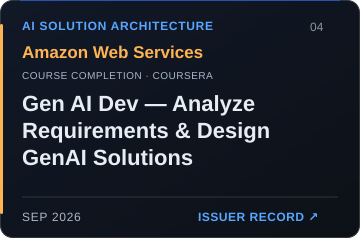

# 💳 Real-Time-Payment-Observability-Dashboard

### Privacy-safe full-stack dashboard for replaying synthetic payment events, monitoring operational risk, and exploring live analytics.

Repository description: Privacy-safe real-time payment observability dashboard with FastAPI, React, WebSockets, Redis, synthetic replay, and guarded analytics.

---

## 🚀 Overview

Real-Time-Payment-Observability-Dashboard is a portfolio-safe version of an operational monitoring system. It turns a synthetic transaction stream into live KPI, anomaly, merchant, terminal, and replay views through an event-driven backend and a responsive browser dashboard.

The public repository runs on generated demo records by default. It contains no production database, customer records, credentials, company names, private endpoints, proprietary datasets, or internship-specific infrastructure. A generic SQL Server adapter is retained only as an optional example against the neutral demo schema documented in the source.

---

## ✨ Features & Modules

| Module | Capability | Engineering Focus |
| --- | --- | --- |
| Live supervision | Streaming KPI, status distributions, and operational rankings | React, TypeScript, ECharts |
| Event pipeline | Transaction events flow through a producer, event bus, aggregator, and cache | Async Python, clear service boundaries |
| Historical replay | Pause, resume, reset, period selection, and fast-forward controls | Deterministic replay state machine |
| Risk analytics | Refusal, timeout, latency, anomaly, and aggregate risk indicators | Incremental analytics |
| Real-time delivery | Initial snapshot plus continuous dashboard updates | FastAPI WebSockets |
| Shared snapshot cache | Redis-backed KPI snapshots with an in-memory fallback | Resilient cache abstraction |
| Local persistence | Synthetic transactions persisted for repeatable local runs | SQLite, repository pattern |
| Conversational analyst | Guarded questions about KPI, anomalies, architecture, and replay state | Local rules/RAG; optional local or hosted LLM |
| Data governance | Whitelisted tools, bounded queries, rate limits, and response sanitization | Privacy-by-design controls |

---

## 🏗️ Architecture



The browser never reads a database directly. Source adapters publish a common transaction-event contract, so the UI, analytics, cache, and WebSocket layers remain independent of the source implementation.

See [`docs/ARCHITECTURE.md`](docs/ARCHITECTURE.md) for additional runtime boundaries and [`docs/SECURITY.md`](docs/SECURITY.md) for the application safeguards.

---

## 🧪 Tech Stack

### Application Layer

| Surface | Technologies |
| --- | --- |
| Frontend | React 19, TypeScript, Vite, Tailwind CSS |
| Visualization | ECharts |
| Backend | Python, FastAPI, Uvicorn, Pydantic |
| Real-time transport | WebSockets |
| Persistence | SQLite / aiosqlite |
| Shared cache | Redis with an in-memory fallback |
| Optional adapter | SQL Server / pyodbc against a neutral demo schema |
| AI assistant | Rule-based fallback, local Ollama, optional OpenAI or Gemini |

### Quality Layer

| Area | Tooling |
| --- | --- |
| Backend tests | `unittest`, FastAPI test client |
| Frontend checks | TypeScript compiler, focused Node tests |
| Dependency review | `npm audit` |
| Runtime safety | Rate limiting, bounded batches, whitelisted tools |

---

## 🔌 API Endpoints

| Endpoint | Method | Purpose |
| --- | --- | --- |
| `/api/health` | `GET` | Backend, cache, persistence, and WebSocket status |
| `/api/supervision/snapshot` | `GET` | Current dashboard state for a supported period |
| `/api/supervision/status` | `GET` | Replay state and progress |
| `/api/replay/start` | `POST` | Start the replay supervisor |
| `/api/replay/pause` | `POST` | Pause event processing |
| `/api/replay/resume` | `POST` | Resume event processing |
| `/api/replay/reset` | `POST` | Reset the active replay |
| `/api/replay/fast-forward` | `POST` | Toggle accelerated replay |
| `/api/chat` | `POST` | Ask the guarded analyst about dashboard evidence |
| `/api/chat/suggestions` | `GET` | Suggested analyst prompts |
| `/ws/payments` | `WS` | Initial snapshot and live supervision updates |

Interactive API documentation is available at `http://127.0.0.1:8000/docs` while the backend is running.

---

## 📁 Directory Structure

```text
.
├── backend/
│   ├── app/
│   │   ├── analytics/          # Incremental KPI and risk aggregation
│   │   ├── api/                # REST endpoints
│   │   ├── cache/              # Redis and memory cache adapters
│   │   ├── chatbot/            # Guarded analyst and local knowledge tools
│   │   ├── mock_data/           # Synthetic transaction generation
│   │   ├── repositories/        # Local persistence boundary
│   │   ├── services/            # Event, replay, and reconciliation services
│   │   └── websocket/           # Connection management
│   ├── tests/
│   └── .env.example
├── frontend/
│   ├── src/
│   │   ├── charts/              # ECharts visualizations
│   │   ├── components/          # Dashboard and assistant UI
│   │   ├── hooks/               # Live-data orchestration
│   │   ├── services/            # REST and chat clients
│   │   └── websocket/           # Browser socket client
│   ├── tests/
│   └── .env.example
├── docs/                       # Architecture, replay, security, and performance notes
├── scripts/                    # Windows setup, run, build, and test helpers
├── docker-compose.yml          # Local Redis service
└── .gitignore                  # Secrets, runtime data, builds, and generated artifacts
```

---

## ⚙️ Installation

### 1. Clone

```bash
git clone https://github.com/MoallaMelek/Real-Time-Payment-Observability-Dashboard.git
cd Real-Time-Payment-Observability-Dashboard
```

### 2. Configure the demo

```powershell
Copy-Item backend\.env.example backend\.env
Copy-Item frontend\.env.example frontend\.env
```

The checked-in examples use synthetic data and localhost services. Do not place real credentials or production connection details in committed files.

### 3. Start the backend

```powershell
python -m venv backend\.venv
backend\.venv\Scripts\python.exe -m pip install -r backend\requirements.txt
backend\.venv\Scripts\python.exe -m uvicorn app.main:app --app-dir backend --host 127.0.0.1 --port 8000 --reload
```

### 4. Start the frontend

```powershell
npm --prefix frontend install
npm --prefix frontend run dev
```

Open `http://localhost:5173`. Redis is optional; without it, the application uses an in-memory KPI cache.

### 5. Optional Redis cache

```powershell
docker compose up -d redis
```

---

## 🔐 Environment Variables

| Variable | Required | Description |
| --- | --- | --- |
| `DATA_SOURCE` | No | Defaults to `mock` for the public synthetic-data demo |
| `DATABASE_URL` | No | Local SQLite URL used by the demo repository |
| `REDIS_URL` | No | Redis connection URL; memory fallback is automatic |
| `BACKEND_CORS_ORIGINS` | No | Comma-separated browser origins |
| `WEBSOCKET_AUTH_TOKEN` | No | Optional WebSocket token for non-local deployments |
| `VITE_API_URL` | Frontend | Backend base URL |
| `VITE_WS_URL` | Frontend | WebSocket URL |
| `CHATBOT_LLM_PROVIDER` | No | `local`, `openai`, `gemini`, or rule-based fallback behavior |
| `LOCAL_LLM_BASE_URL` | No | Local Ollama-compatible endpoint |
| `OPENAI_API_KEY` | No | Optional hosted provider key; leave empty otherwise |
| `GEMINI_API_KEY` | No | Optional hosted provider key; leave empty otherwise |

Start from `backend/.env.example` and `frontend/.env.example`. Real `.env` files are ignored by Git.

---

## 🧪 Validation

```powershell
.\scripts\test-backend.ps1
.\scripts\typecheck-frontend.ps1
.\scripts\build-frontend.ps1
npm --prefix frontend audit
```

The test suite covers event aggregation, replay state, API/WebSocket contracts, chatbot safeguards, cache behavior, reconciliation logic, and visual interpolation.

---

## 🖼️ Screenshots

| Live Dashboard | Conversational Analyst |
| --- | --- |
|  |  |

### Analytics & Alerts



Every capture above was produced locally from the bundled synthetic-data mode. No non-public environment, company system, customer record, or production endpoint is shown.

---

## 🧭 Roadmap

| Milestone | Status |
| --- | --- |
| Synthetic local replay with SQLite persistence | Available |
| Live WebSocket dashboard updates | Available |
| Redis KPI cache with graceful fallback | Available |
| Guarded conversational analytics | Available |
| Docker profile for frontend and backend | Planned |
| Cross-platform launcher scripts | Planned |
| CI for backend tests and frontend checks | Available |
| Synthetic-data screenshots | Available |
| Short demo video | Planned |

---

## 📦 Artifact Strategy

Runtime databases, generated RAG indexes, logs, cache files, build outputs, archives, and environment files are intentionally excluded from Git. Knowledge indexes can be rebuilt locally with `scripts/build_rag_index.py` from the sanitized public documentation.

This keeps the repository cloneable and prevents generated artifacts from reintroducing removed text or local data.

---

## 🛡️ Confidentiality & Publication Note

This repository is a sanitized portfolio reconstruction. It demonstrates engineering patterns using synthetic data and neutral identifiers only. It does **not** include employer or customer names, production records, credentials, API keys, internal URLs, private endpoints, original database identifiers, proprietary datasets, or production configuration.

No open-source license is granted in this version. Confirm ownership and authorization before adding a license or publishing internship-derived work. If any future commit connects to a real environment, keep that adapter and its configuration private.

---

## 🙏 Acknowledgments

Built as a software engineering portfolio project exploring real-time dashboards, event-driven services, operational analytics, resilient caching, privacy-aware data access, and explainable conversational tooling.

---

From synthetic payment events to actionable operational insight.

<!-- certifications:start -->
## Relevant Certifications

Related training completed by **Melek Moalla**, with the connection to this project stated below.

<a href="https://coursera.org/verify/DQZ61608JYWW"></a>

**Amazon Web Services · Gen AI Dev- Agentic AI Solutions and Tool Integrations**  
Related to the chatbot’s controlled tool catalogue, tool selection, and grounded response workflow.  
[Verify / issuer record](https://coursera.org/verify/DQZ61608JYWW) · [Original PDF](https://github.com/MoallaMelek/MoallaMelek/blob/master/certificates/aws-agentic.pdf)

<a href="https://coursera.org/verify/3SRF1BKFHQ9M"></a>

**Vanderbilt University · AI Agents and Agentic AI with Python & Generative AI**  
Related to Python tool interfaces and conversational state in the chatbot. Its tools are constrained; this is not an unrestricted autonomous agent.  
[Verify / issuer record](https://coursera.org/verify/3SRF1BKFHQ9M) · [Original PDF](https://github.com/MoallaMelek/MoallaMelek/blob/master/certificates/vanderbilt-agents.pdf)

<a href="https://coursera.org/verify/KN4I9UGNT0WZ"></a>

**Amazon Web Services · Gen AI Dev- Analyze Requirements & Design GenAI Solutions**  
Related to the separation of business requirements, allowed data access, retrieval, and grounded response composition.  
[Verify / issuer record](https://coursera.org/verify/KN4I9UGNT0WZ) · [Original PDF](https://github.com/MoallaMelek/MoallaMelek/blob/master/certificates/aws-genai-design.pdf)

<sub>The AWS credentials are Coursera course completions. The association concerns learning; it does not claim an AWS deployment or issuer endorsement.</sub>

<!-- certifications:end -->
