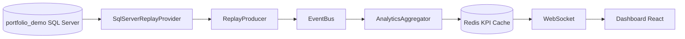

# Architecture Dashboard TPE

Le projet repose sur un **replay historique des transactions portfolio_demo**.

Flux principal à conserver :

1. SQL Server portfolio_demo sert de source historique uniquement.
2. `SqlServerReplayProvider` lit des lots bornés et ordonnés.
3. `ReplayProducer` transforme les lignes en événements.
4. `EventBus` publie les événements transactionnels.
5. `AnalyticsAggregator` construit la projection KPI.
6. `RedisKpiCache` stocke le snapshot KPI partagé quand Redis est disponible.
7. Le WebSocket diffuse le snapshot au dashboard React.

Contraintes :

- Le dashboard ne lit jamais SQL directement.
- Le LLM ne lit jamais SQL directement.
- Les requêtes SQL libres sont interdites.
- Les outils SQL passent par l'interface publique du provider de replay.
- Redis reste un cache/snapshot partagé, pas une source métier.
- `ReplayProducer` pourra être remplacé par un producteur live sans changer le dashboard.
- OpenAI/Gemini restent optionnels.
- Le mode principal reste local/fallback/Ollama-compatible.

